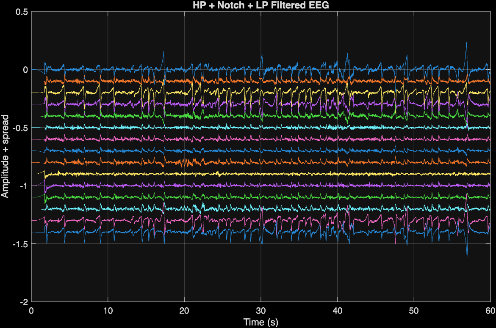
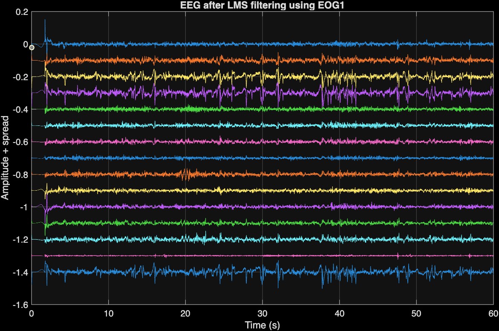
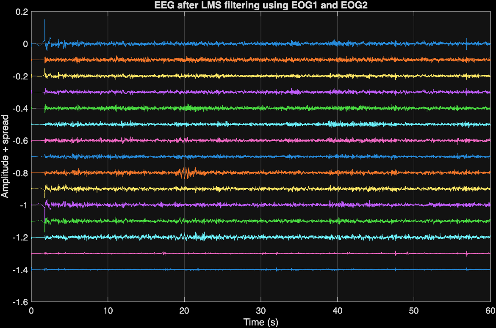
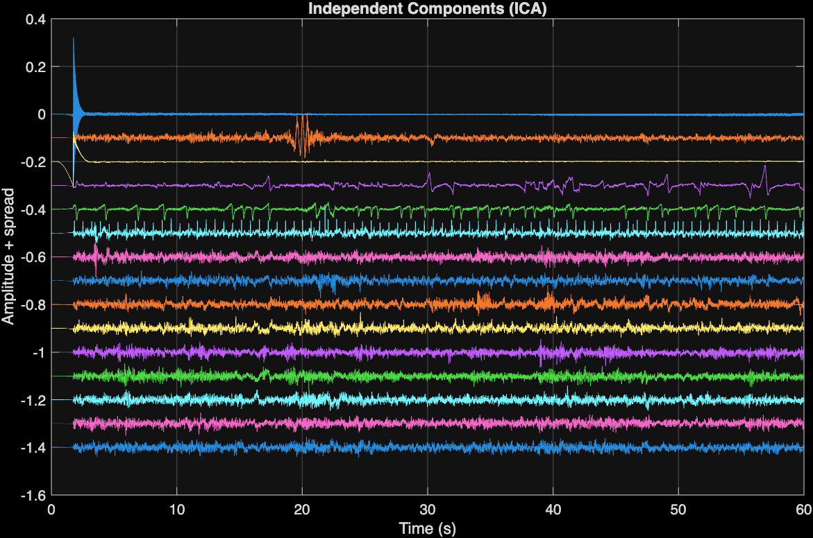
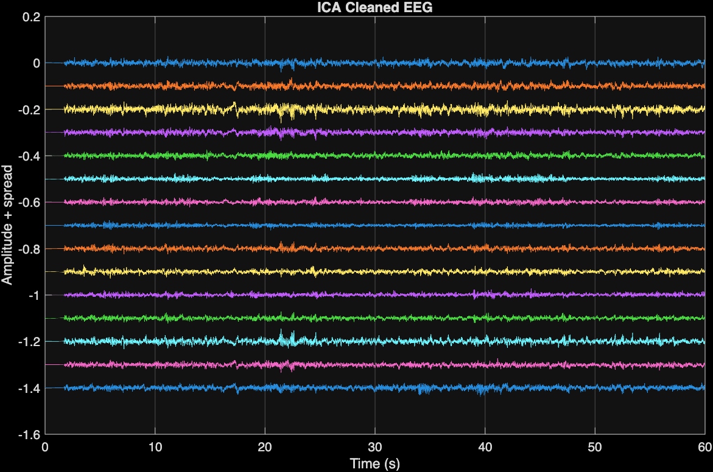

# EEG Artifact Removal using Filtering, LMS, and ICA

This repository contains a MATLAB implementation of EEG artifact removal techniques developed as part of the **Biosignal Processing course**.

The project demonstrates how multiple signal processing techniques can be combined to improve EEG signal quality.

---

# Project Overview

Electroencephalography (EEG) signals often contain various artifacts such as:

- Eye movements (EOG artifacts)
- Power line interference (50 Hz noise)
- Baseline drift
- High-frequency noise

To address these issues, the following pipeline was implemented:

1. Basic signal filtering
2. Adaptive filtering using LMS
3. Independent Component Analysis (ICA)

---

# Processing Pipeline
- Raw EEG
- High-pass filter
- Notch filter (50 Hz)
- Low-pass filter
- LMS adaptive filtering (EOG artifact removal)
- ICA artifact removal
- Clean EEG signal

---

# Task 2 – Basic Filtering

Three filters were designed using MATLAB's **Filter Designer**:

| Filter | Purpose |
|------|------|
| High-pass | Remove slow baseline drift |
| Notch (50 Hz) | Remove power line interference |
| Low-pass | Remove high-frequency noise |

Filters were exported as MATLAB functions and applied sequentially.

### Filtered EEG Output

---

# Task 3 – Adaptive Filtering (LMS)

Eye movement artifacts were removed using an **adaptive LMS filter**.

Two reference channels were used:

| Reference | Artifact Removed |
|------|------|
| EOG1 | first-stage eye movement artifacts |
| EOG2 | remaining artifacts |

### LMS Stage 1

### LMS Stage 2

---

# Task 4 – ICA Artifact Removal

Independent Component Analysis (ICA) was performed using the **FastICA toolbox**.

The EEG signal was decomposed into independent components:

\[
EEG = A \times IC
\]

Where:

- **IC** = independent components
- **A** = mixing matrix

Artifact components were identified visually and removed by setting them to zero.

### Independent Components

### Cleaned EEG Signal

---

# Tools Used

- MATLAB
- DSP System Toolbox
- FastICA toolbox
- MATLAB Filter Designer

---

# Author

Jamil Al-Rubaye  
Masters Degree Biomedical Engineering Student  
University of Oulu
