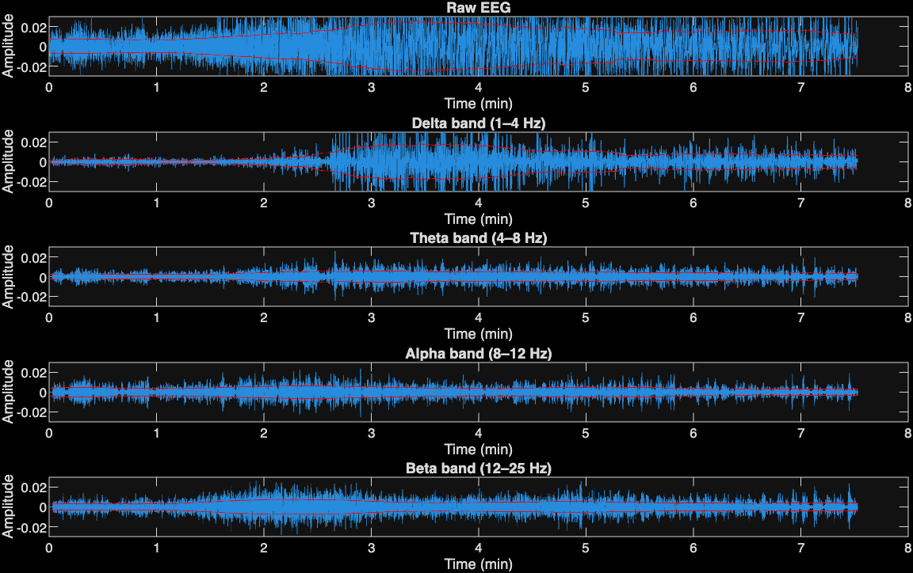
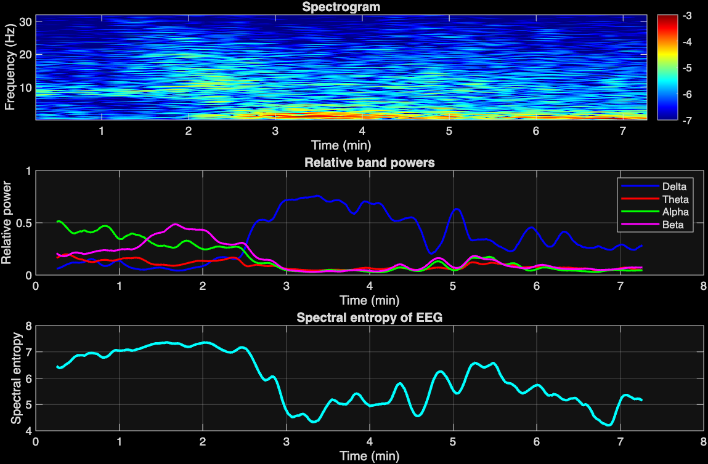

# Lab 2 – EEG Signal Analysis

This lab focuses on analyzing EEG signals using frequency-based methods and time-frequency representations.

## 📊 Objectives

* Apply bandpass filtering to extract EEG frequency bands
* Compute RMS envelopes of filtered signals
* Analyze time-frequency content using spectrograms
* Calculate relative band powers
* Evaluate signal complexity using spectral entropy

---

## ⚙️ Methods

### 1. Bandpass Filtering

The EEG signal was filtered into standard frequency bands:

* Delta (1–4 Hz)
* Theta (4–8 Hz)
* Alpha (8–12 Hz)
* Beta (12–25 Hz)

FIR filters were designed using a Hamming window and applied to the signal.

---

### 2. RMS Envelope

A 30-second window was used to compute the RMS envelope of each band, showing signal power variations over time.

---

### 3. Spectrogram

A spectrogram was computed to visualize how frequency content evolves over time.

---

### 4. Relative Band Power

The power of each band was normalized by total power:

* Helps identify dominant brain activity over time

---

### 5. Spectral Entropy

Spectral entropy was calculated to measure signal complexity:

* High entropy → more complex signal
* Low entropy → more regular/structured signal

---

## 📈 Results

### Bandpass Filtering and RMS Envelopes

### Spectrogram, Relative Power, and Spectral Entropy

---

## 🛠️ Files Included

* `S2_2505770_Jamil_Alrubaye.m` – Main MATLAB script
* `data_2.mat` – EEG dataset
* `Bandpass_RMS.png` – Task 1 results
* `Spectrogram_RelativePower_Entropy.png` – Task 2 results

---

## 💡 Notes

* FIR filters were implemented using `fir1`
* Spectrogram computed using MATLAB’s `spectrogram` function
* Results are plotted in minutes for better readability

---

## 👤 Author

Jamil Alrubaye
