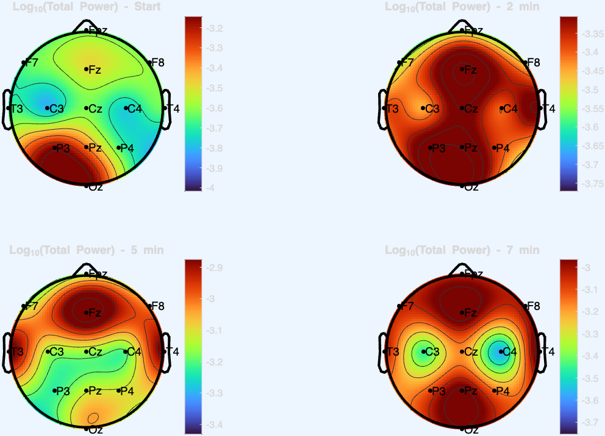
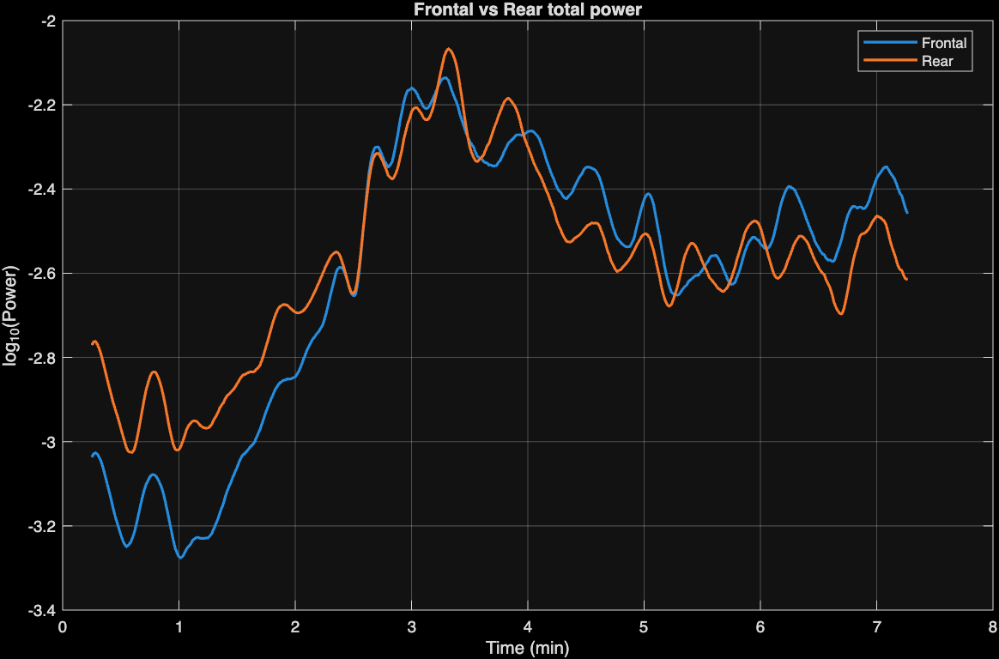
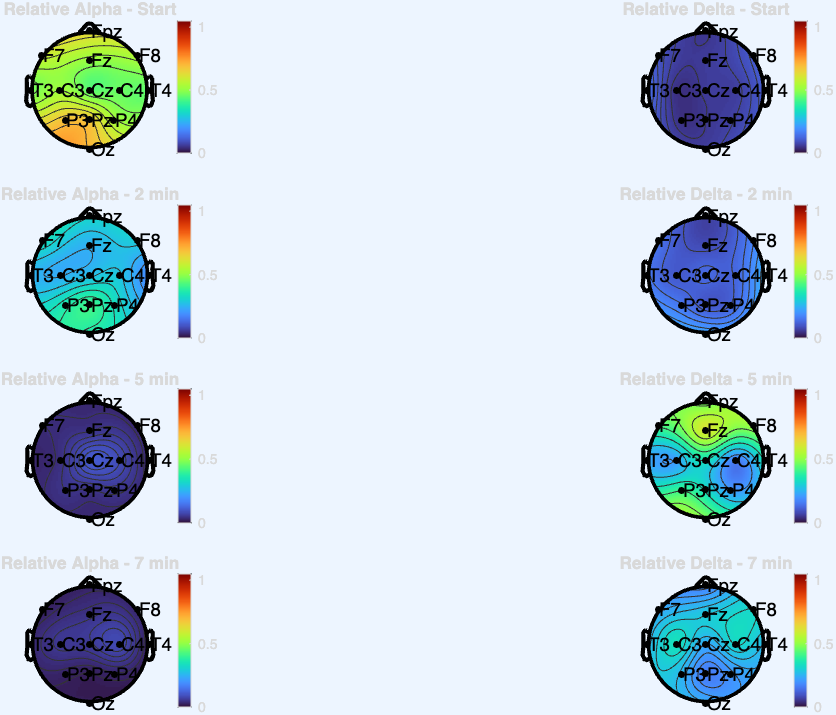

# Lab 3 – Topographic EEG Analysis

## Overview

This laboratory exercise focuses on spatial EEG signal analysis using spectrogram-based power estimation and topographic visualization.

The goal is to understand how brain activity evolves over time and how it is distributed across different regions of the scalp.

---

## Objectives

* Compute spectrogram-based power for each EEG channel
* Visualize spatial distribution using topographic maps (topoplots)
* Compare frontal and rear brain activity over time
* Analyze relative alpha and delta band power

---

## Methods

### Spectrogram Analysis

* Window length: 30 seconds
* Overlap: 29 seconds
* Frequency range: 0.1–32 Hz

Power spectral density (PSD) is computed for each EEG channel using the spectrogram.

---

### Total Power

Total power is calculated by summing PSD values across all frequencies for each time point.

---

### Frontal vs Rear Comparison

Channels are grouped based on their anatomical location:

* **Frontal region:** Fpz, F7, Fz, F8
* **Rear region:** P3, Pz, P4, Oz

The total power of each region is computed and compared over time.

---

### Relative Band Power

Frequency bands used:

* **Delta:** 1–4 Hz
* **Alpha:** 8–12 Hz

Relative power is calculated as:

Relative Power = (Band Power) / (Total Power in 0.1–32 Hz)

---

## Results

### Topographic Maps – Total Power

* Power increases over time across most scalp regions
* Spatial distribution shows stronger activity in frontal areas

---

### Frontal vs Rear Power

* Both regions show increasing power initially
* Differences appear as the signal evolves

---

### Relative Band Power

* **Alpha power** decreases over time
* **Delta power** increases, indicating slowing brain activity
* Clear spatial differences between regions

---

## Tools Used

* MATLAB
* Signal Processing Toolbox
* EEGLAB (topoplot function)

---

## Author

Jamil Alrubaye
Master’s Student in Biomedical Engineering
University of Oulu
